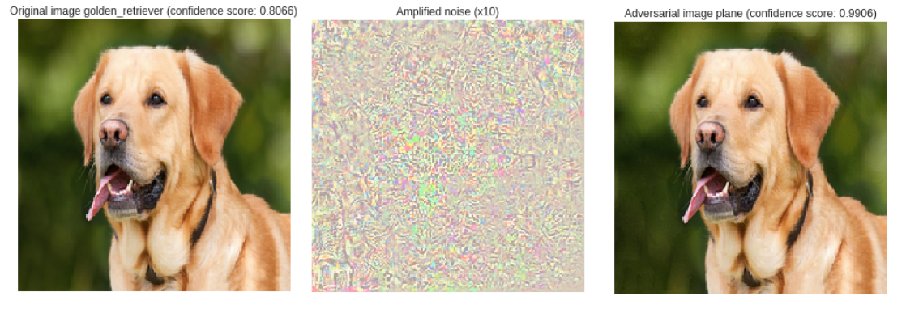

This is a shallow overview of the security of machine learning systems. Within a few scrolls we'll go through:

- ️[Adversarial Example](#adversarial-examples)
- [Model Theft](#model-theft)
- [Dataset Poisoning](#dataset-poisoning)
- [Dataset Protection](#dataset-protection)


## ️Adversarial Examples

The adversarial examples (AE) topic is fascinating and an [active](https://arxiv.org/search/advanced?advanced=&terms-0-operator=AND&terms-0-term=adversarial+examples&terms-0-field=title&classification-computer_science=y&classification-physics_archives=all&classification-statistics=y&date-filter_by=all_dates&date-year=&date-from_date=&date-to_date=&size=50&order=-announced_date_first) area of research. It raises fundamental questions related to the limits and the security of our current gradient-based classifier architectures. AE are cleverly crafted data designed to be misclassified by a targeted model. They are "designed to cause the model to make a mistake" ([OpenAI](https://blog.openai.com/adversarial-example-research/), Attacking Machine Learning with Adversarial Examples). The image on the right is an adversarial example.



The difference between the left and the rightmost dog is probably unperceptible. This can be due to our eyes limitations (or the bit depth of your monitor).
And yet they are crucial to various models. The last image is indeed [considered](https://github.com/maxpv/maxpv.github.io/blob/master/notebooks/Adversarial_ResNet50.ipynb) as a `plane` by a `ResNet50` initialized with default training weight in Keras, and one AE will probably work on another architecture. The only difference are small pixels values, amplified in the second picture.

We can notice that `ResNet50` was pretty confident that the dog on the left picture is a `golden_retriever` (~80%) and the crafted image is a `plane` with a higher confidence (~99%). So a model can be tricked into making a mistake with the confidence score we desire, we in general just need to train it long enough. What are the impacts of misclassifying with an arbitrary confidence score?

Recommendation systems are also studied for [adversarial recommendation](https://arxiv.org/pdf/1809.08336.pdf), influencing a recommendation system through indistinguishable fake users.

#### Safety

In most known models, any image can be crafted into another class with an arbitrary confidence score.
So our dog can be misclassified as anything we wish with any arbitrary accuracy.
It has been shown that it works in the physical world too, for instance, if we [print](https://arxiv.org/abs/1607.02533) them. A famous example is tricking a car's sensor to see
a speed limit instead of a STOP sign. The output of a model can be manipulated into making to some extent, a desired decision or at generating unhandled behavior by the application that relies on it.


By the end of 2017 some showed that modifying one pixel can be enough in some cases. If you want to know more about this you can read
the paper [One pixel attack for fooling deep neural networks](https://arxiv.org/abs/1710.08864), enjoy a high-level presentation by
the [One minute paper](https://www.youtube.com/watch?v=SA4YEAWVpbk) channel or check this [Keras implementation](https://github.com/Hyperparticle/one-pixel-attack-keras).

Adversarial examples are simple attack and don't require much computation. On relatively small images a good GPU can craft an AE in less than a minute.
This is a real security issue and that is probably why we can read those line at the end of some related subject [papers](https://arxiv.org/abs/1602.02697):

> Research was also supported in part by the Army Research Laboratory, under Cooperative Agreement Number W911NF-13-2-0045 (ARL Cyber Security CRA), and the Army Research Office under grant W911NF-13-1-0421.

#### Different threats level and techniques

We know that adversarial examples play with the decision boundaries of a classifier. We can, for instance, add random pixels on an image and *change* the classification or wisely choose those added pixels and *choose* the classification. Depending on the threat objective we denote:

- Confidence reduction increases the ambiguity between classes by reducing the model's confidence for a given image.
- Misclassification changes the output class to *another* class than the original one.
- Targeted misclassification forces the output of a specific input to be a specific target class.

Depending on the opponent's knowledge, there are three ways of crafting adversarial examples. Each with their own assumed prior knowledge of the target. Knowing:

- the model as a whole including its weights (*gradient-base*),
- only the score of each class (*score-based*),
- only the prediction (*transfer-based*).

A simplified copy of a diagram by Papernot. et al in The Limitations of Deep Learning in Adversarial Settings (page 3):


One example of **gradient-base attack** consists in computing the loss' gradient function an image. Following by a tiny step in the opposite gradient's direction. In order to keep valid RGB values, the image might be clipped between 0 and 255 and the value of the noise between 0 and a small value, M.
This value M determine the maximum difference between the original image and the adversarial one, so M should be smaller than a human's color sensibility (through a monitor). M smaller than 5 should be fine.
The previous technique is called the iterative least-likely class method. Other types of gradient techniques exist like a fast gradient sign method. You can read [this paper](https://arxiv.org/abs/1607.02533) (part 2, page 3). We can note that they all require a complete knowledge of the model and its weights.

**Score-based attacks** rely only on the predicted model's score to estimate the gradient and then apply the previous technique.
**Transfer-based attacks** rely exclusively on the output label. This is a more realistic scenario compared to score-based and gradient-based. You can find
an example of a transfer-based attack in the section Model Theft.

#### Defence

Here we won't go much in depth I encourage you to search the keywords that attract you, it deserves a blog post on its own. We can see two big categories of defences:

> - *Reactive*: where the objective is an adversarial example prior being called on by our model for an inference.
> - *Proactive*: where the objective is to make the models more resilient to this kind of attack.
> [Black Box Attacks](https://arxiv.org/abs/1602.02697) by Nicolas Papernot et al.

Example of reactive defenses:

- [MagNet](https://arxiv.org/abs/1705.09064) a 'two networks' model composed of an auto-encoder capable of reforming before being fed to a classifier. Several auto-encoder are needed here so it's resource expensive.

Example of proactive defenses:

- [Random depthwise signed convolutional neural networks](https://arxiv.org/abs/1806.05789)
- Label smoothing (2016)
- Mixup (2017)
- Adversarial training, re-training the neural network with a subset of adversarial examples
- [Logit pairing](https://www.google.com/search?&q=logit+pairing+neural+network) this one is very new (2018) and "achieves the state of the art defense for white box and black box attacks on ImageNet"

## Model Theft

Trying to rebuild someone's else model or retrieve data that were used to train the model. The dataset and or the model might be confidential for their sensitive or commercial value.

> The tension between model confidentiality and public access motivates our investigation of model extraction attacks. ([Source](https://www.usenix.org/system/files/conference/usenixsecurity16/sec16_paper_tramer.pdf))

We'll summarize briefly the [Black Box Attacks](https://arxiv.org/abs/1602.02697) by Nicolas Papernot et al. If you want to dig this subject you might enjoy reading it. The main idea described here is to create a local substitute neural network trained with a substitute dataset crafted by the adversary. Then, using gradient-based techniques adversarial examples can be generated.


There's no need for a labeled dataset, which can be expensive to produce. The substitute dataset is labeled using the remote DNN's output.
Then the local dataset is locally augmented through a technique called *Jacobian-based Dataset Augmentation*.
Here is a pseudo code describing the Jacobian data augmentation (full code available on [github](https://github.com/tensorflow/cleverhans/blob/023c3061f073e09204285949c85122da42e43d63/cleverhans/attacks_tf.py)).

```
def jacobian_augmentation(dataset):
  """
  - get_label: API call on the remote oracle
  - alpha: step size
  - jacobian: returns jacobian matrix of the substitute model
  """
  jacobian_dataset = []
  for sample in dataset:
    label = get_label(sample)
    jacobian_sample = sample + alpha*sign(jacobian(substitute_model, label))
    jacobian_dataset.append(jacobian_sample)

  return jacobian_dataset
```

Basically, each example is augmented by adding a small variation in direction of the gradient.

They emphasize that:

> [...] this technique is not designed to maximize the substitute DNN’s accuracy but rather ensure that it approximates the oracle’s decision boundaries with few label queries.

The choice of architecture isn't very important since we can assume some details beforehand. There is a high chance that a CNN was used for an image classification task. It is also possible to train simultaneously several architectures.

An implementation of a similar attack is available on [Github](https://github.com/labsix/limited-blackbox-attacks).


## Dataset Poisoning

Dataset poisoning attacks aim at manipulating model's behavior at test time.

Poisoning 3% of a training set managed to drop the test accuracy by 11% ([Certified Defenses for Data Poisoning Attacks](https://arxiv.org/abs/1706.03691) by Steinhardt at al. (2017)).


Label flipping attack the objective is to maximize the loss function if a subset of the training example's label is flipped, this is basically done by gradient ascent:


> An attacker first chooses a target instance from the test set; a successful poisoning attack causes this target example to be misclassified during test time. Next, the attacker samples a base instance from the base class, and makes imperceptible changes to it to craft a poison instance; this poison is injected into the training data with the intent of fooling the model into labeling the target instance with the base label at test time. Finally, the model is trained on the poisoned dataset (clean dataset + poison instances). If during test time the model mistakes the target instance as being in the base class, then the poisoning attack is considered successful
> [Poison Frogs! Targeted Clean-Label Poisoning Attacks on Neural Networks](https://arxiv.org/pdf/1804.00792.pdf)


## Dataset Protection

### Fully homomorphic encryption


Fully homomorphic encryption is an encryption scheme that preserves the operation on data through encryption and decryption function. If the scheme is preserved over the addition, encrypting a sum or summing the encrypted members will give the same result.
This means that you can encrypt your data locally and send it to a server, let it do a job using only the supported operators and return you the encrypted result. You don't need to trust the server since it won't understand what it is manipulating.

Let `ENC` and `DEC` the encryption and decryption function respectively:
```
ENC(X1 + X2) = ENC(X1) + ENC(X2) (homomorphism)
Since X1 + X2 = DEC(ENC(X1+ X2))
We have X1 + X2 = DEC(ENC(X1) + ENC(X2))
```

If you would need to follow one person in this field, it would be [Craig Gentry](https://researcher.watson.ibm.com/researcher/view.php?person=us-cbgentry). He found the first FHE scheme in 2009.

> Much of Craig's recent work, including FHE and cryptographic multilinear maps, generally falls into the area of "lattice-based cryptography". Unlike commonly-used cryptosystems like RSA and elliptic-curve cryptography, lattice-based cryptosystems cannot feasibly (as far as we know) be broken by quantum computers. ([IBM](https://researcher.watson.ibm.com/researcher/view.php?person=us-cbgentry))

The most important part here is that if one day this encryption schemes exists we can (almost) not care about the privacy of our data we're sending on a remote machine. If this machine is malicious it can just give you wrong results but can't exploit your data...
Unless... If we're talking about an FH encrypted machine learning model trying to predict something, nothing guarantees you that the model is empty at first and your opponent can still do inferences on the young model (by observing boundaries decisions and such). You should check out [CryptoDL](https://arxiv.org/abs/1711.05189).


### Dataset theft

It is also possible to recover the data used  at training by simply looking at the model's output, [Membership Inference Attacks Against Machine Learning Models](https://arxiv.org/abs/1610.05820):

> given  a  data  record  and  black-box  access  to a  model,  determine  if  the  record  was  in  the  model’s  training dataset. To perform membership inference against a target model, we make adversarial use of machine learning and train our own inference  model  to  recognize  differences  in  the  target  model’s predictions  on  the  inputs  that  it  trained  on  versus  the  inputs that  it  did  not  train  on.

An implementation can be found [here](https://github.com/csong27/membership-inference).

----
